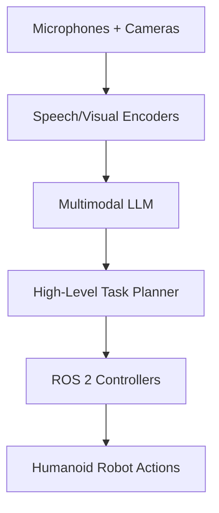

# Chapter 5: Vision-Language-Action (VLA) Integration

This chapter introduces how to integrate **speech**, **vision**, **language models**, and **robotic actions** into a unified VLA system for humanoid robots. All examples are written using Python, ROS 2, and modern AI toolchains (Transformers, Whisper, BLIP-2, etc.).

---

## Overview

Vision-Language-Action (VLA) systems are the foundation of modern embodied AI. They allow humanoid robots to:

- Understand spoken or written natural language
- Interpret and reason about visual scenes
- Plan actions based on goals
- Execute robotic motions and behaviors

A VLA-enabled humanoid robot can understand commands like:

> “Find the mug on the table and bring it to me.”

and then perform the complete task autonomously.

---

## VLA Architecture Overview

A high-level system design contains:

### 1. Vision Module
Handles scene understanding:
- Object detection
- Segmentation
- 3D scene reconstruction
- Human pose tracking
- Depth processing

Example technologies:
- YOLOv8
- BLIP-2
- SAM (Segment Anything Model)
- DINOv2

### 2. Language Module
Handles:
- Task interpretation
- Clarifying user intent
- Generating high-level plans

Usually implemented using:
- GPT-style LLMs
- Instruction-tuned LLMs
- VLMs with cross-attention to vision

### 3. Action Module
Executes robot behaviors:
- Manipulation (grasping)
- Navigation
- Locomotion
- Task sequencing

Powered by:
- ROS 2 control
- Whole-body MPC
- Inverse kinematics
- Motion planning (MoveIt 2 etc.)

---

## Example VLA Pipeline

```
Speech → STT → Language Model → Vision Query → Action Plan → Controller → Robot Motion
```

Example:

1. User says:  
   **“Pick up the blue book near the window.”**
2. Whisper transcribes the speech.
3. LLM parses the task.
4. Vision model locates all blue objects.
5. Spatial reasoning model determines which one is "the book near the window".
6. Action planner creates a sequence:
   - Walk to table  
   - Reach target  
   - Grasp  
   - Return to user
7. Robot executes plan.

---

## Example Code: Vision + Language Task Extraction

```python
from transformers import BlipProcessor, BlipForConditionalGeneration
from PIL import Image

processor = BlipProcessor.from_pretrained("Salesforce/blip-image-captioning-large")
model = BlipForConditionalGeneration.from_pretrained("Salesforce/blip-image-captioning-large")

img = Image.open("scene.jpg")
inputs = processor(img, return_tensors="pt")
caption = model.generate(**inputs)

print("Scene caption:", processor.decode(caption[0], skip_special_tokens=True))
```

---

## Example Code: VLA Task Interpretation (LLM)

```python
import openai

prompt = """
You are a robotics VLA planner.
Task: "pick up the blue mug near the sink"
Vision objects: ["mug_blue_1", "mug_red_1", "sink", "table"]
Determine the correct object and produce a step-by-step plan.
"""

res = openai.ChatCompletion.create(
    model="gpt-4.1",
    messages=[{"role": "user", "content": prompt}]
)

print(res['choices'][0]['message']['content'])
```

---

## Action Planning: ROS 2 Integration Example

```python
# pseudo-code for sending task steps to a humanoid controller
from robot_control_interface import HumanoidController

controller = HumanoidController()

plan = [
    ("navigate", {"target": "sink"}),
    ("locate_object", {"name": "blue_mug"}),
    ("grasp", {"object": "blue_mug"}),
    ("return_to_user", {}),
    ("release", {})
]

for action, params in plan:
    controller.execute(action, params)
```

---

## VLA for Embodied Reasoning

Modern humanoids use VLA to perform:

### 1. Spatial referencing  
Understanding:
- “left of”
- “behind”
- “closest to me”

### 2. Ambiguity resolution  
Robot asks:
> “There are two mugs. Which one do you mean?”

### 3. Multimodal reasoning  
Combine text + images + proprioception.

---

## Multimodal Prompting Example

```python
prompt = """
You see an image of a cluttered kitchen. Identify all possible objects
the user might refer to as “the large container.”
"""

inputs = {
    "image": kitchen_img_tensor,
    "text": prompt
}

result = vla_model.generate(inputs)
```

---

## Recommended VLA Models (2025)

| Model | Type | Strength |
|-------|------|----------|
| PaLM-E | VLA | Robotics grounding |
| OpenAI VLMs | VLM | Strong spatial + reasoning |
| BLIP-2 | VLM | Visual description |
| LLaVA | LVLM | Lightweight open-source |
| RT-X | Robotics | Large-scale action learning |

---

## Combining VLA With Control (Full Pipeline)



---

## Common Pitfalls & Solutions

| Problem | Solution |
|---------|----------|
| LLM hallucination | Use grounding via vision + environment state |
| Ambiguous instructions | Implement dialogue-based clarification |
| Incorrect grasp target | Add depth + segmentation cross-checks |
| Latency issues | Use edge inference + quantization (TensorRT) |

---

## Learning Objectives

By the end of this chapter, you should be able to:

- Understand how vision, language, and action connect in a VLA pipeline  
- Use multimodal models for scene understanding  
- Build LLM-based task planners  
- Integrate VLA outputs with ROS 2 motion control  
- Design safe, interpretable humanoid behaviors  

---

## Further Reading

- Google PaLM-E Paper  
- OpenAI Embodied LLM Research  
- RT-X: Large-Scale Robot Training  
- BLIP-2: Vision-Language Pretraining  
- LLaVA: Lightweight VLMs  

---

End of Chapter 5.

